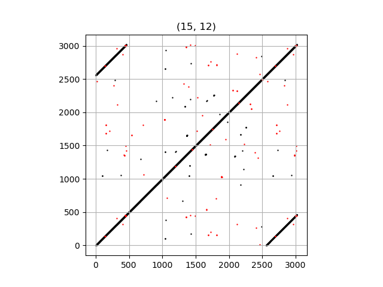
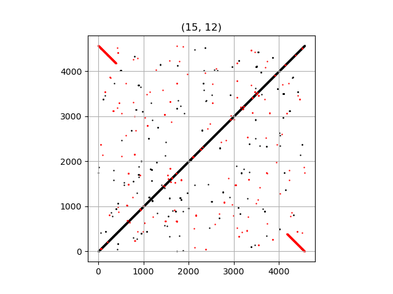
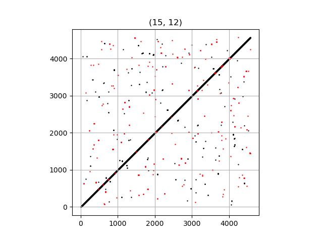
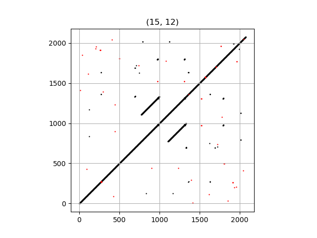
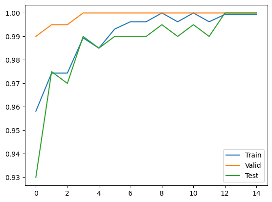
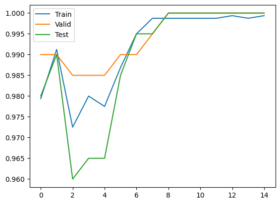
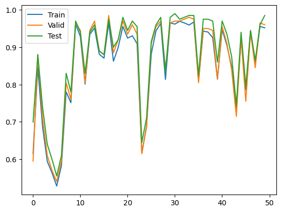

1. [Быстрая реализация Dot Plot DNA на Python](https://gitlab.com/transposable_elements/src/-/blob/main/utils/fast_dot_plot_dna.py)
2. Генерация датасета
   - [Генерация графов-графиков](https://gitlab.com/transposable_elements/src/-/blob/main/generate_dataset/generate.py)
   - [Формирование файлов csv](https://gitlab.com/transposable_elements/src/-/blob/main/generate_dataset/write_csv.py)

|  LTR (повторы на концах) |  TIR (палиндромы на концах) |
|------------------------------|------------------------------|
|  NO (нет повторов) |  INNER (повторы внутри) |

3. Результаты обучения GNN

 LTR-NO

 LTR-TIR

 LTR-INNER

[Ссылка на данные](https://drive.google.com/drive/folders/1JHspYMC_GHS-FgYl7MKfZsH-PzcG2EXR?usp=sharing)